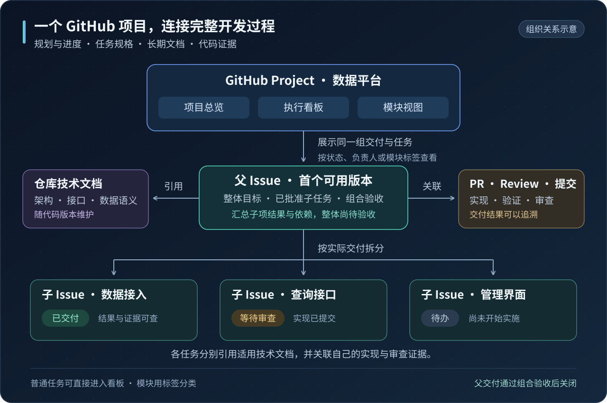
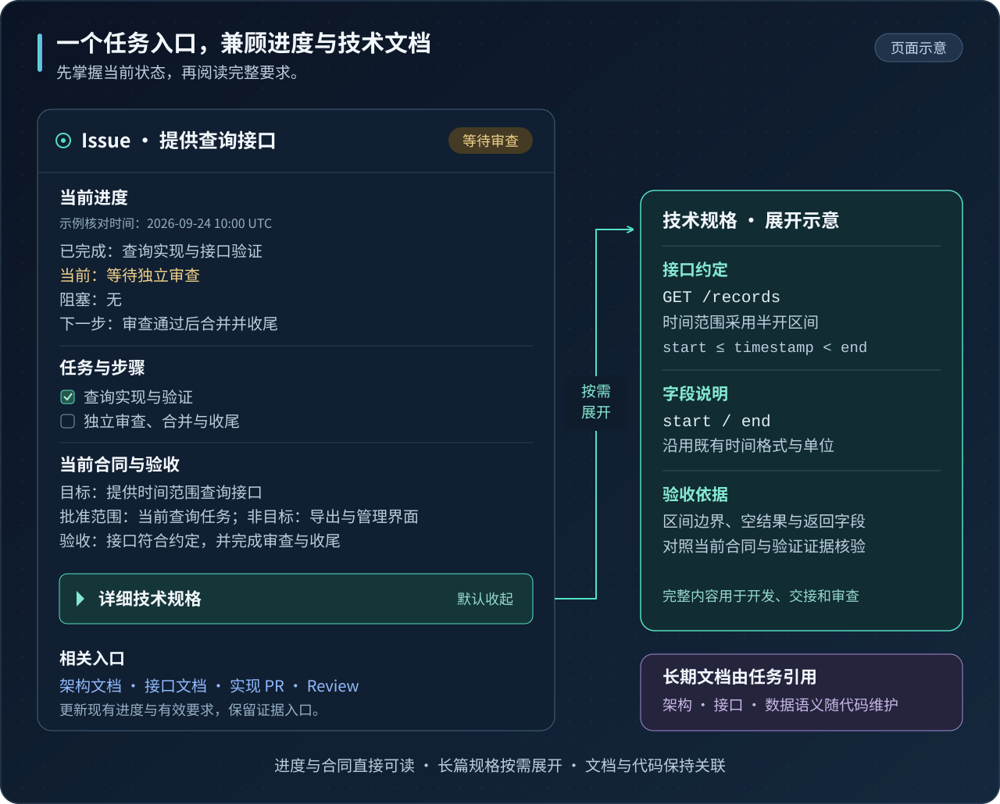
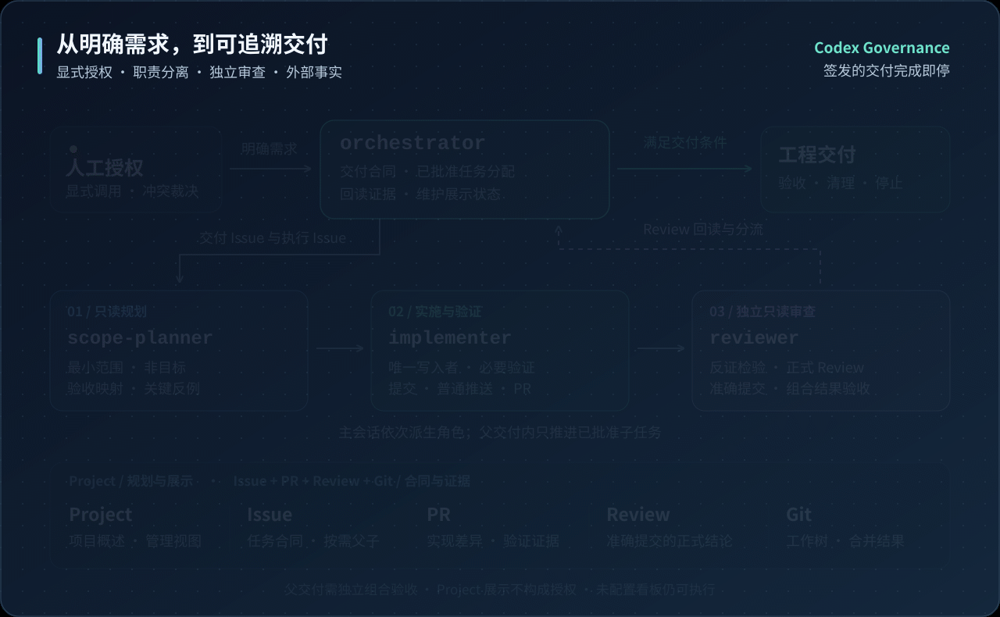
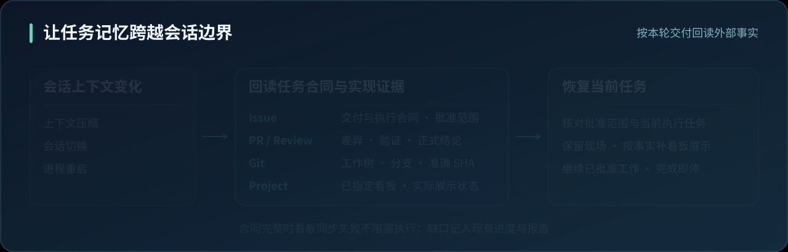

<div align="center">

# Codex Governance

### 面向长程任务的 AI 开发治理

**在 GitHub 中管理大型项目，让开发进度、技术文档与代码交付保持关联。**

<p>
  <a href="#project-management">项目管理</a> ·
  <a href="#issue-documents">技术文档</a> ·
  <a href="#architecture">治理架构</a> ·
  <a href="#long-running">长程任务</a> ·
  <a href="#engineering">工程机制</a> ·
  <a href="#codebase-memory">代码检索</a> ·
  <a href="#start">快速接入</a> ·
  <a href="#evidence">验证与证据</a>
</p>

</div>

Codex Governance 基于 **Codex 原生主会话、自定义子代理与 GitHub 任务事实**，将一次明确需求组织成可追溯的开发闭环：范围规划、实现、独立审查、反馈分流、合并与收尾。

**充分利用 GitHub Projects 与 Issues 的免费能力，无需额外订阅项目管理或开发文档工具。** 通过项目视图掌握整体进展，通过 Issue 管理当前需求、任务规格与验收，再连接仓库中的长期技术文档、代码变更和审查证据。开发者与 AI 围绕同一份当前要求协作，让任务记忆可恢复、自主探索有边界、工程交付有证据。

GitHub 官方提供 [Issues 与 Projects 免费层](https://github.com/features/issues)；这里的免费指项目管理和文档承载能力，Codex 与模型使用费用按所选服务另计。

| **4 个职责角色** | **2 个 GitHub 身份** | **4 项工程原则** | **1 个本轮交付边界** |
|:---:|:---:|:---:|:---:|
| 编排 · 规划 · 实现 · 审查 | 明确操作归属 | 约束 · 语义 · 状态 · 验证 | 单 Issue 交付或已批准父交付 |

<a id="project-management"></a>

## 用 GitHub 管理大型项目与技术文档

一个项目可以同时拥有项目总览、执行看板和模块视图，分别查看整体交付、当前任务和某个模块的工作。
这些视图筛选或分组同一组 Issue，保留任务与代码之间的关联。GitHub 原生支持表格、看板和路线图等
[项目视图](https://docs.github.com/en/issues/planning-and-tracking-with-projects/learning-about-projects/about-projects)。

Codex Governance 在这些能力上明确内容的维护职责：主会话在任务开始、进入审查、阻塞、恢复和完成等
状态变化后更新当前 Issue、适用父级摘要和已指定 Project；实现者与审查者提供实际结果及证据。
用户可以从项目总览进入具体任务，再追溯适用规格、实现差异和验收结果。



数据平台示例：数据接入已经交付，查询接口等待审查，管理界面仍待办。负责人从 Project 查看整体进展，
打开父 Issue 了解剩余交付和依赖，再进入查询接口 Issue 阅读当前要求与对应 PR。图中项目、任务及状态均为示意。

### Project 管理总体规划，Issue 保存任务合同

| 想了解的内容 | 查看位置 | 保存的信息 |
|---|---|---|
| 项目目标与整体进展 | Project | 目标与范围概述、规划入口、总览、执行看板和模块视图 |
| 一项较大交付包含哪些工作 | 父 Issue | 整体目标、已批准子任务、依赖、结果摘要和组合验收 |
| 一个任务做到哪一步 | 普通 Issue 或子 Issue | 当前进度、目标、范围、非目标、批准边界、步骤和验收 |
| 任务的完整技术要求 | Issue 正文 | 当前有效的任务规格、接口细节及适用技术文档引用 |
| 系统长期采用什么约定 | 仓库技术文档 | 随代码版本维护的架构、接口和数据语义 |
| 实际改了什么、如何验证 | PR、Review 与提交 | 实现差异、验证证据、正式审查结论与最终版本 |

父子 Issue 按真实交付需要组织，单 Issue 交付可以直接进入看板；步骤保留在任务正文。模块通过标签和视图分类，
Milestone 按实际发布或时间目标选用。父交付在已批准子任务完成必要收尾、并通过独立组合验收后关闭；子任务全关闭
或看板进度达到 100% 不能代替整体验收。已有正式总体合同直接引用。

只维护已明确指定的 Project，未配置时照常完成 Issue 闭环。看板状态、排序和父子关系都不构成实施授权。
合同完整时，Project 同步失败只留下展示缺口，由主会话在现有进度和报告中说明。
对象职责与完成语义见[治理规范](governance/codex-development-governance.md)，
看板起点与视图建议见[安装说明](docs/installation.md#7-project-接入建议)。

<a id="issue-documents"></a>

### 一个任务入口，兼顾进度浏览与完整技术规格

打开 Issue，先看到已完成成果、当前步骤、阻塞与下一项交付，再阅读任务要求和验收条件；长篇规格、字段表、
公式与接口细节按需展开。折叠只改变展示，实施、交接和审查仍读取完整适用内容。



图中展示同一任务的页面概览与技术规格展开效果，仅为内容组织示意；具体呈现与维护遵守
[Issue 呈现与维护](governance/engineering-principles.md#issue-呈现与维护)，简单任务按实际需要裁剪。

**任务相关规格由 Issue 承载，长期技术文档随代码版本维护。** Issue 引用适用的架构、接口与数据语义，
Project 提供规划与文档入口。任务推进时更新原有进度和有效要求；讨论与决策经过留在评论，代码差异和
验证证据留在 PR，正式审查结论留在 Review。这样，进度、文档与代码可以在 GitHub 内持续关联。

<a id="architecture"></a>

## 一张图理解治理架构



图示按角色职责展开并循环播放。［[查看静态全图](docs/assets/governance-framework.svg)］触发提交前内容审查时，
角色按下文往返交接；图中编号不能作为实现、提交和审查的固定线性顺序。

主会话 `orchestrator` 维护当前任务合同，首次依次派生三个职责分离的子角色。角色之间的交接由主会话协调；同一共享写入路径只有一个 `implementer`。适用的提交前内容审查、返工、提交与正式 Review 可在同一实现者和审查者之间继续交接。审查结果返回主会话，由它核验结论、分流返工，并判断是否满足推进条件。

| 角色 | 关键职责 | 向下一环节交付什么 |
|---|---|---|
| **`orchestrator`** | 定位交付 Issue，维护合同与展示，分配已批准子任务，分流反馈与收尾 | 准确执行 Issue、适用合同和推进决定 |
| **`scope-planner`** | 只读澄清需求，组织最小任务，寻找反例 | 验收场景、任务与依赖、必要依据和决策缺口 |
| **`implementer`** | 实施已批准范围，前置必要验证及适用的内容审查通过后提交 | 待提交差异与验证证据，后续 PR、准确提交与工作树归属 |
| **`reviewer`** | 独立只读审查候选、PR 或组合，从失败条件出发检验证据 | 候选内容结论、绑定准确 PR 头的正式 Review，或组合审查结论 |

> **判断与推进分离。** 审查者提出结论，主会话回读真实状态后决定下一步；新的实现提交必须重新审查。

<a id="long-running"></a>

## 为长程任务建立连续性

### 目标持续一致：让 Agent 围绕当前合同工作

多轮开发会不断产生新发现、替代方案和局部优化机会。Codex Governance 把这些探索放进明确的任务边界：当前 Issue 保存目标、范围、非目标与验收标准，规划角色返回最小充分方案，实现与审查共同对照同一合同。

这套设计把防止 Agent 偏离落实到了具体交接点：**实施前核对范围，审查时检验合同，发生冲突时交由用户裁决，当前任务完成后停止。** 范围变化必须更新当前合同，普通评论与历史讨论不能自行取得执行效力。

上述[任务入口](#issue-documents)持续保留可回读的当前要求与技术细节，并分别说明规格已审、代码已合并
和整体验收的状态，帮助下一轮工作准确接续。

### 任务记忆外置：让上下文变化之后仍有恢复依据

单个 Agent 同时承载规划、实现、调试与审查，会让同一会话积累大量历史。上下文压缩、会话切换和进程重启，都需要重新确认哪些目标、决定与执行结果仍然有效。

本项目将任务记忆放在可重新读取的工程对象中：**Issue 保存当前合同与组合审查结果，PR 保存差异与验证，Review 保存正式 PR 审查结论，Git 保存实现事实。** Project 引用这些对象展示规划与进度。角色按需读取当前任务及相关证据，使关键决定具有独立于会话摘要的恢复来源。



按恢复顺序展开，循环播放。［[查看静态全图](docs/assets/context-recovery.svg)］

| 需要恢复的信息 | 读取位置 | 恢复时的判断依据 |
|---|---|---|
| 当前要完成什么 | Issue 正文及必要的上层 Issue | 当前有效目标、批准范围与验收标准 |
| 已经实现了什么 | PR 差异、提交与测试证据 | 真实实现及尚未解决的问题 |
| 哪个版本经过审查 | 当前 PR 头与正式 Review | `commit_id` 是否与当前头一致 |
| 本地现场能否继续 | 工作树、分支与远端引用 | 未提交内容、提交可达性与准确对象归属 |
| 看板是否需要补更新 | 已指定 Project 的实际条目和选项 | 依据 Issue 与审查事实补展示，不改变授权 |

上下文压缩与任务记忆治理承担不同职责：前者缩减会话上下文，后者提供可回读的目标和工程状态。本项目在这一层建立恢复约定，降低关键事实仅依赖压缩摘要保留的风险。[OpenAI 上下文压缩文档](https://developers.openai.com/api/docs/guides/compaction)

### 高推理能力的探索边界：深入分析，明确实施依据

面对 `ultra` 等高推理等级下的自由探索，治理需要说明哪些探索结果有权进入实现。项目通过明确非目标、最小修改原则、任务批准范围和冲突裁决，把方案比较与反例检验约束在当前任务内。

工程分析、实现与审查共同遵守四项原则：**行为约束有依据，领域语义与合同一致，状态与责任最小，验证对应真实失败条件。** 权威正文见[工程准则](governance/engineering-principles.md)，角色按[治理规范第三节](governance/codex-development-governance.md)读取；普通开发同样适用。

规则按职责维护：工程准则保存通用工程原则、Issue 呈现与工程裁决记录要求；治理规范集中定义 GitHub
任务授权、角色权责和完成条件。Skill、Profile 与角色入口负责引导读取和提示当前职责，编排程序说明
具体交接与操作。README 解释使用方式，不另设一套推进条件；规则变化时更新权威正文及适用入口，避免多份完整重述留下旧规则。

代码、历史测试或代理建议不能自动成为需求。已确认违反适用工程规则的无依据限制或重复机制必须阻塞；审查者要求新增合同外行为则须遵守授权边界。普通实现参数只有实际改变合同语义时才按行为约束处理。

新增机制的提出者须说明它对应的批准要求、现有实现或保证留下的缺口，以及为什么这个机制是最小必要
改动。自产消费者或配套测试不能单独证明机制有用；具体判断遵守四项原则，不凭类型、摘要或哈希的名称决定。
审查沿生产者、转换边界和消费者核对合同语义，检查重复状态的实际用途与权威归属。验证还要能识别所声称的
业务错误；错误计算仍能通过自产摘要或自证布尔检查时，这些检查不能证明业务正确。

复杂工作按实际交付拆分，不强制“项目—模块—阶段”Issue 树。模块用标签及视图区分；涉及整体约束时读取
适用父合同或技术文档。显式签发父 Issue 可以顺序完成已批准子任务并进行组合验收；仅签发一个子 Issue
则在该任务完成后停止。后来挂入的任务和规划中的下一项仍须属于本轮批准范围才能执行。

<a id="engineering"></a>

## 从治理理念到工程机制

这套设计的扎实之处，是把授权、任务记忆、角色协作和交付质量落实到已有工具与真实对象。Codex 承担原生编排，GitHub 承担任务事实与审查记录，Git 提供准确提交和工作树状态；定制部分集中在职责、合同与推进条件。

| 工程机制 | 实现方式 | 解决的具体问题 |
|---|---|---|
| **显式启用** | `allow_implicit_invocation: false`，所有入口统一调用条件 | 普通修改或仅提及 Skill 时意外进入完整治理 |
| **当前合同唯一** | 目标、范围与批准状态保存在对应 Issue | 多份计划和对话摘要产生相互竞争的任务状态 |
| **代码图辅助检索** | 按实际工作树查询派生索引，核对相关范围并回读源码 | 查询错版本、遗漏消费者，或把过期索引当成实现事实 |
| **需求细化与任务覆盖** | 澄清关键语义，用行为场景表达验收，按真实依赖组织任务 | 模糊要求被补成新需求，任务遗漏或没有依据 |
| **职责与身份分离** | 原生角色配置、私有身份绑定、启动后回读身份 | 写入归属不清、继承环境与预期身份不一致 |
| **双向对抗性审查** | 从要求核对实现与证据，再从新增行为追查依据，以反例检验结论 | 漏做要求、加入无依据行为，或用实现者结论自证正确 |
| **适用的内容审查前置** | 指定设计变更在提交前审查候选，提交后复用证据形成正式 Review | 实质设计问题只在提交后发现，或重复全量审查 |
| **验证结果决定推进** | 必要验证通过后才推进相应交付动作；失败时修复或报告 | 测试或验收失败，仍按流程提交、批准与合并 |
| **组合结果验收** | 父交付独立审查核对准确组合版本、调用、接口与状态流转 | 各子任务分别完成，但整体行为没有成立 |
| **准确提交批准** | Review 显式携带 `commit_id`；合并匹配 `headRefOid` | 审查之后提交变化，旧结论被用于新代码 |
| **反馈先核验再分流** | `CHANGES_REQUESTED` 返回主会话 | 把错误审查或范围外建议直接转换成代码修改 |
| **合并后同步本地** | 快进更新实际检出默认分支的主工作树，并按需确认索引 | 远端已合并多轮，本地日常路径仍停留在旧代码 |
| **证据保留与产物清理** | 独立保存核心证据，清理无用产物；备份盘不可用时停止并交用户裁决 | 反复构建占满磁盘，或为释放空间丢失必要证据 |
| **收尾属于完成条件** | 工作树归属、提交可达性、远端尖端复核与条件删除 | PR 合并后遗留任务现场，或清理错误对象 |

<a id="codebase-memory"></a>

### 代码检索与 GitHub 任务管理相互补充

可接入 `codebase-memory-mcp`，帮助定位定义、调用关系、消费者和修改影响范围。**代码索引是可以从源码
重建的派生缓存；Issue 保存任务合同，Project 展示规划与进度。** 不把需求、批准状态或项目决策复制进
工具的 ADR 或另一套任务台账。普通开发也可使用代码图，不因此启用 GitHub 治理。

索引跟随实际工作树选择：创建任务工作树后查询该工作树，审查时核对被审版本。字面量与文档搜索继续
使用 `rg`，关键结论回读当前源码。`index_status` 的 `ready` 或 `git.head_sha` 不能证明索引已覆盖当前
源码；按相关文件或范围使用 `check_index_coverage` 检查新鲜度与解析缺口，索引未命中也不能证明没有调用者。

| 现有流程中的位置 | 索引维护与使用职责 |
|---|---|
| 主会话准备代码探索 | 选择当前工作树，按需准备仓库外缓存，交接源码版本与已知缺口 |
| 实现者开发及交付审查前 | 维护任务工作树索引，交付前主动确认本轮所需范围，按需刷新并说明结果 |
| 规划者与审查者读取代码 | 查询与当前判断版本相符的已有索引，回读源码；不主动建立、重建或删除索引 |
| 主会话同步本地主工作树后 | 主动确认本轮需要使用的主工作树索引，按需刷新，在现有收尾报告中说明结果或缺口 |

后台监听不保证每个工作树始终更新，会话重连也不证明离线变化已补齐。刷新失败或仍无法确认时，使用当前
源码补足证据并说明缺口；不要求每次任务全量重建，也不把刷新成功设为新的审查、合并或关闭 Issue 门槛。
只读角色允许的工具自动缓存更新须经验证只发生在仓库外，不能改动被审对象或 Git 配置。

查询原则见[代码检索与派生索引](governance/engineering-principles.md#代码检索与派生索引)，职责与缓存边界见
[代码查询与索引职责](governance/codex-development-governance.md#代码查询与索引职责)，客户端配置及副作用验证见
[接入与维护](docs/installation.md#codebase-memory)。

### 审查结合项目决策与 OCR 规则

`reviewer` 回顾当前项目与改动相关的已批准决策及取舍理由，同时检查实现和拟提出的审查意见是否与仍有效
的决定冲突。决策入口沿用各项目已有的 Issue、评论或索引，由主会话定向定位并交接；不同项目分别提供
自己的引用，不固定公共 Issue 编号，也不默认扫描全部历史。适用前提变化或出现新证据时，说明具体影响，
按现有反馈流程处理。

可选接入 Open Code Review（OCR）CLI。工具可用、已有调用方式能准确覆盖待审对象，且包含其支持的源码行为变更时，默认批量调用
`ocr delegate rule` 获取适用规则，由当前 Codex reviewer 完成分析，沿用现有 Codex 模型与额度，
无需另配 OCR 模型或 API Key。规则读取和分析仍消耗 Codex 额度；本治理不调用完整 `ocr review` 引擎。
OCR 的规则与筛选只提供审查线索，完整差异中的测试、删除和配置变化仍须按实际影响审查。
没有适用于未提交候选的调用方式时，直接按完整真实差异审查，不为 OCR 提前创建提交或 PR，也不用旧提交范围冒充候选。
安装和调用方式见 [OCR 辅助审查](docs/installation.md#ocr-review)。

审查意见须有适用依据、成立条件与实际影响；同根因问题合并，缺少测试或存在其他设计选择本身不构成
缺陷。必要证据足够时结束审查。新提交仍需获得绑定当前头的结论，但复用有效证据，重点检查修复、新变化
及其影响；重新提出已裁决的问题须说明新增证据、先前遗漏或条件变化。工具不可用或无适用规则时沿用
治理审查，不因 OCR 增加审查阶段或自动安装步骤。完整规则见[独立审查与正式 Review](governance/codex-development-governance.md#3-独立审查与正式-review)。

### 指定设计变更先审内容，再创建提交

当本轮变更新增或改变运行时接受、拒绝行为，领域合同及跨边界转换，业务事实的可变副本或权威关系，
或运行时放行、验收所依赖的证明与复核时，主要内容审查移到提交前。触发按实际行为判断，不按技术名称。
未启用治理的任务同样适用。仅补充验证既有要求、未改变验收含义或运行时状态及放行条件的普通测试，不自动增加这道审查；
改变这些含义或引入影子证明机制时仍按实际行为判断。其他未涉及上述变化的改动沿用原路径，详见
[提交前独立内容审查](governance/engineering-principles.md#提交前独立内容审查)。

实现者完成前置必要验证和自审后，交付基线、完整待提交 Git 差异及本轮相关的新增、删除和未跟踪文件，并区分暂存区与工作区。
审查期间暂停候选写入。审查者只读核对内容，主会话分流发现，由同一实现者修正、重新验证，通过后才提交和推送。
候选有变化时复审受影响范围；已有旧提交按当前差异纠正，不为补做前置审查重写历史。

合同明确安排在提交或推送后的 CI 等检查，可以在前置必要验证通过且没有已知未解决失败时随后运行。
启用 GitHub 治理时，提交后由同一审查者核对准确提交与候选是否一致、后置检查及新差异，再形成正式 Review，
复用仍适用的内容结论。正式批准和合并须等待全部适用验证通过；候选内容结论不能代替这些条件。
未启用治理的任务按用户授权完成适用审查，不因此启用 GitHub 治理或创建 PR、正式 Review。

### 审查与合并之间保留一道准确边界

`reviewer` 通过 GitHub Pull Request Review REST API 提交正式结论，请求体显式包含已审查的 `commit_id`。主会话在合并前再次核对当前头、必需检查、审查线程与阻塞反馈。只有本轮分配任务满足合同、必要验证通过、精确头正式获批且没有未解决阻塞，才用 `--merge --match-head-commit <SHA>` 执行保留实现提交的普通合并。

必要测试或验收失败，或当前交付动作的前置必要验证未完成、结果不明或关键证据不足时，停止受影响的提交、推送、请求批准、批准、
合并与完成。当前授权内可继续排查和修复，通过相应验证后恢复；需要改变合同或授权时交用户决定。
记录失败或取得正式批准不能代替通过，会话恢复也遵守同一条件。普通开发同样适用，验证阶段与恢复条件见
[验证结果与交付推进](governance/engineering-principles.md#验证结果与交付推进)。

新提交触发重新审查；反馈存在语义争议时，先判断属于实现缺陷、审查问题、范围不清，还是需要用户裁决。完整规则见[治理规范](governance/codex-development-governance.md)。

父交付的已批准子任务完成实施与必要收尾后，独立 `reviewer` 只读审查实际组合结果并返回结论，由主会话
记录到父 Issue，通过后才关闭父交付。子任务全关闭、PR 全合并或看板显示 100% 都不能替代该验收。
单个 PR 的审查范围来自执行 Issue 中本轮分配任务，PR 正文不能自行缩小该范围。

治理 PR 均以 `Refs` 关联实际执行 Issue，不使用 `Closes` 等自动关闭关键字。主会话在合同验收及合并后
必要同步、清理完成后关闭对应 Issue；没有专用工作树时仍须完成主工作树同步，不能在合并时提前关闭。
完成、取消、重复按原生关闭原因区分，Project 的“已结束”不等于交付成功。

### 合并之后，仍然对工程现场负责

每次确认合并后，主会话将实际检出远端默认分支的本地主工作树快进更新到本次抓取的最新提交，例如日常
使用的 `main` 路径；仅执行 `fetch` 或更新任务工作树不能代替这一步。同步后按上述职责确认本轮需要
使用的代码索引，不能把源码同步成功当成索引已更新。

同步须保留既有未提交内容；分叉、覆盖冲突或其他阻碍导致无法快进时，保留现场并说明原因，不自动
执行 `reset`、`rebase`、`stash` 或覆盖内容，也不声称本地收尾完成。本地同步失败不取消远端合并事实；后续任务仍按
实际依赖与既有授权处理，任务清理的安全门和关闭限制继续独立适用。

本轮创建的任务专用工作树及对应分支必须完成清理。清理前核对准确归属，证明实现头、本地任务分支与远端任务分支都已被新鲜默认分支包含；远端引用删除使用准确尖端作为租约预期值，防止误删已经变化的任务引用。

构建产物与证据按用途分别处理：审查前独立保存核心证据，收尾时释放已无用途的本轮产物，不能因为
`target` 等目录中混有少量证据就整体保留。核心证据包括适用版本、必要命令与环境信息、实际结果及
支撑验收或复现所需的原始材料，不能只留“通过”摘要。正式交付物、仍被使用或归属不明的对象继续保留；
共享缓存不随单个任务整体删除。大规模或反复构建前检查实际输出占用与可用空间，开发期间及时清理
已无用途的本任务产物，不等磁盘写满才收尾。

小型且可公开的证据沿用现有交付记录；大型或私有材料可迁往已授权的仓库外归档位置，只保存必要材料，
不整包搬走构建目录。备份盘归档先确认实际挂载和可用空间，再复制并核对完整性、可读取性，更新证据
入口后才删除源副本。各项目实际归档位置保存在仓库外的[私有绑定](templates/local.example.toml)中，
不借用其他项目目录，也不向未挂载备份盘的同名目录写入。

**需要使用备份盘而发现其不存在、未挂载、无法读写或空间不足时，立即停止当前任务，保留现场并向用户
汇报原因、证据保存状态、未完成工作与待裁决事项。** 等待期间不继续构建、迁移、局部清理或推进后续
任务，不自行重试、修复挂载或更换位置；备份盘恢复后仍按用户裁决继续。无需使用备份盘的任务不以
备份盘可用性作为启动条件。通用要求见
[构建产物与证据生命周期](governance/engineering-principles.md#构建产物与证据生命周期)。

没有创建专用工作树的任务仍须处理主工作树同步；原有主工作树与归属不明对象必须保留。这让“完成”包含实现结果、证据闭合和资源收尾。详细程序见[合并与收尾约定](skills/codex-stage-orchestrator/references/stage-procedure.md#5-合并与收尾)。

### 模型与职责分别配置

公共模板默认继承安装者已有的模型与推理配置。主会话和三个角色都可以在仓库外的原生 TOML 中分别
设置 `model`、`model_reasoning_effort`；模型选择不写入身份绑定，也不扩大职责或任务授权。

| 配置内容 | 维护位置 |
|---|---|
| 主会话模型、推理等级与权限 | 该入口的原生 `config.toml`，以及按需选择的 Profile |
| 各角色的模型、推理等级与权限覆盖 | 安装后的三个角色 TOML |
| GitHub 账号与目录、公共源路径 | 仓库外的私有本机绑定 |
| 工程原则与治理职责 | 本仓库的公共规则正文 |

公共示例沿用 `danger-full-access` 与 `never` 的命令权限；父会话实时权限覆盖仍可作用于子代理。
角色隔离属于受监督职责分离，不等同于操作系统级或凭据级强隔离。

<a id="start"></a>

## 快速接入

先按[手动安装说明](docs/installation.md)填写仓库外的[私有绑定](templates/local.example.toml)，安装并注册
三个原生角色，接入用户级 Skill；Profile 是可选启动预设。公共仓库只提供通用规则和
示例，填写后的账号、路径与运行配置保留在本机。
安装完成后：

**1. 接入目标仓库。** 将[接入片段](templates/repository-AGENTS.fragment.md)的语义合并进目标仓库根 `AGENTS.md`，保留原有项目规则。
采用 Project 时增加 `项目看板：<Project URL>`；没有看板可省略，无须补建宏观父级或 Milestone。
已有决策记录时，可增加 `项目决策记录：<本项目已有决策 Issue 或索引的完整链接>`，或沿用当前合同中的引用。

**2. 明确启用条件。** 只有目标仓库已接入，且用户在当前消息中显式调用 `codex-stage-orchestrator` 并给出明确开发需求，才启用治理。未显式调用时不启用；用户明确禁止使用时不启用。仅提及名称、普通修改、历史调用或启动 Profile 均不能替代显式调用；同一已授权任务内的继续执行沿用原有授权。

**3. 正常启动 Codex。**

```bash
codex -C /绝对路径/目标仓库
```

配置好的 `codex-b`、`codex-c` 也按相同方式启动。无需 `--profile codex-governance`；如需采用该预设，
仍可显式选择。调用 Skill 本身不改变当前会话的模型、权限或并发设置。

多个入口各自在基础 `config.toml` 中注册角色，可共用同一组角色文件和 `~/.agents/skills` 下的 Skill，
保留各自的主会话配置、认证与会话数据。角色只接收显式启用后的主会话交接；注册角色本身不启用治理。
核对更新覆盖范围时，分别检查各入口的全局规则引用、基础角色注册描述及文件引用、实际 Skill 安装目录，
以及可选 Profile 的实际目标。`--profile codex-governance` 会叠加该入口的 `codex-governance.config.toml`；
共用 Profile 时更新一次实际文件，并核对各入口仍指向它。共享引用指向同一份内容；独立复制的角色、
Profile 或 Skill 文件仍须同步。公共源修改不会自动改写这些副本或注册描述。
升级保留各入口的模型、权限及私有路径，用新会话分别核对基础配置与可选 Profile；旧会话不保证热加载。
具体步骤见[多个入口、更新与迁移](docs/installation.md#6-多个入口更新与迁移)。

需要代码图时，按[codebase-memory-mcp 接入与维护](docs/installation.md#codebase-memory)在每个实际使用的
`CODEX_HOME/config.toml` 中注册工具并验证仓库外缓存边界。共享 `AGENTS.md` 或角色文件不会共享 MCP
注册；`codex`、`codex-b`、`codex-c` 分别配置，不覆盖各入口原有设置。

**4. 显式签发当前任务。** Issue URL 或编号可以省略，由主会话在当前仓库定位唯一匹配对象，或创建最小必要 Issue。

```text
$codex-stage-orchestrator
本次只处理这个明确需求：<需求正文>。
请定位或创建准确 Issue，并完成范围规划、实现、正式审查、合并与收尾。
当前任务完成后停止。
```

### 开始管理你的项目

采用 Project 时，可以按以下顺序接入；看板配置方法见[Project 接入建议](docs/installation.md#7-project-接入建议)。

1. **指定项目入口。** 选择实际采用的 Project，在目标仓库声明 `项目看板：<Project URL>`。
2. **按需要组织视图。** 配置项目总览、执行看板和模块视图，复用负责人、标签与父子关系；既有看板沿用适用字段。
3. **签发当前交付。** 明确本轮处理的任务或父交付及已批准范围。主会话随实际进展维护 Issue 和指定 Project，
   用户从看板进入任务，阅读当前规格、实现与验收证据。

创建 Project、修改字段结构或批量导入属于另行明确提出的项目管理工作；普通开发任务维护已指定的看板。
下面分别给出单任务、父交付和无 Project 的调用示例。

### 示例：把需求变成可验收的实现

以下为方法示例，具体语义以目标项目的正式合同和用户决定为准：

```text
$codex-stage-orchestrator
为现有 CSV 导出增加时间范围筛选，复用现有查询接口，导出字段保持不变。
本次只完成这个任务。
```

规划角色先核对查询接口和 CSV 合同，确认时间字段、区间端点及空结果行为。已有定义直接引用；影响实现或验收的关键缺口交主会话向用户澄清。规划结果说明最小修改范围、必要任务和可观察的验收结果，由主会话维护当前 Issue。

实现者把筛选接入真实导出路径，完成前置验证与自审，按实际变更交付适用的待提交候选。审查者既核对筛选是否生效、字段是否保持，也追查新增限制或接口的依据。例如，内部保持全部结果的分批读取可以是普通实现选择；自行加入“最多导出 31 天”的拒绝条件则需要正式依据与相应授权。提交后的 PR 保存要求、实现与验证证据，再按准确版本形成正式 Review。

多 PR 的单 Issue 交付在最终 PR 审查中核对相关组合结果；父交付另做独立组合审查。过程沿用 Issue、PR 与 Review，
内容按任务规模裁剪，简单任务可以使用简短说明。

### 示例：签发父交付

```text
$codex-stage-orchestrator
本轮签发父 Issue #120，顺序完成其合同中已批准的子任务 #121、#122。
使用仓库声明的 Project。完成子任务及必要收尾后，独立审查准确组合版本与整体行为；
验收通过后关闭父交付并停止，不扩展到后来挂入但尚未批准的任务。
```

若只签发 `#121`，闭环只覆盖该子任务；可以更新父级结果摘要，但不执行 `#122` 或关闭 `#120`。

### 示例：没有 Project 的简单修复

```text
$codex-stage-orchestrator
修复现有导出按钮重复点击触发重复请求的问题，沿用现有接口与错误行为。
本仓库未配置 Project，请定位或创建一个准确 Issue，完成审查、合并及收尾后停止。
```

此时不要求补建看板、父 Issue、模块宏观 Issue 或 Milestone。

这些方法吸收了 GitHub Spec Kit 的[需求澄清](https://github.com/github/spec-kit/blob/v1.0.6/templates/commands/clarify.md)、[一致性分析](https://github.com/github/spec-kit/blob/v1.0.6/templates/commands/analyze.md)和[实现收敛](https://github.com/github/spec-kit/blob/v1.0.6/templates/commands/converge.md)思路，由现有四角色与 GitHub 事实源承载；当前实现通过治理指令工作，语义判断仍依赖真实依据与独立审查。

配置文件的定位、账号映射与原有身份核验语义统一见[治理规范第四节](governance/codex-development-governance.md#四角色与身份)。
多套 Codex 入口可以共用私有绑定；安装、升级和已有个人环境的迁移见[手动安装说明](docs/installation.md)。
公开报告使用仓库相对路径，清理所需的工作树绝对路径保留在私有角色交接中。

<a id="evidence"></a>

## 验证与可追溯证据

治理修改通过实际差异与独立只读审查核对条文依据、入口引用和角色职责。工程任务仍按自身需求选择必要验证，证据保存在对应 PR 与 Review。

| 可以直接核验的内容 | 证据入口 |
|---|---|
| 工程原则及授权边界 | [工程准则](governance/engineering-principles.md) |
| 角色与运行配置的公共示例 | [角色示例](codex/agents/) · [Profile 示例](codex/runtime/codex-governance.config.example.toml) |
| 本机配置的字段与安装方法 | [绑定示例](templates/local.example.toml) · [手动安装](docs/installation.md) |

当前规范版本为 `0.7.0`，状态为 **受监督试运行（`SUPERVISED_TRIAL`）**。规则正文与审查结论不能单独证明执行效果；长程任务中的漂移率、压缩频次和交付效率尚无对照测量，应结合具体项目的执行记录判断。

旧项目、模块、阶段 Issue 保留其合同、编号和证据，已批准正文步骤继续有效，不自动迁移或重新解释为
整棵树的授权。其他业务仓库硬编码的旧规则在后续接入时定向处理。

## 仓库导览

| 路径 | 内容 |
|---|---|
| [governance/](governance/codex-development-governance.md) | 工程准则、目标、授权、角色、审查与完成条件 |
| [codex/agents/](codex/agents/) | 三个自定义子代理的原生配置示例 |
| [codex/runtime/](codex/runtime/codex-governance.config.example.toml) | 主会话运行 Profile 的公共示例 |
| [skills/codex-stage-orchestrator/](skills/codex-stage-orchestrator/) | 显式调用入口、编排程序与调用策略 |
| [templates/](templates/repository-AGENTS.fragment.md) | 目标仓库接入片段与本机绑定示例 |
| [docs/assets/](docs/assets/) | 项目组织与 Issue 文档示意图、治理架构与任务恢复动画 |

本项目采用 [MIT 许可证](LICENSE)。

<div align="center">

**Codex 原生编排 · GitHub 项目与文档管理 · 可追溯工程交付**

</div>
